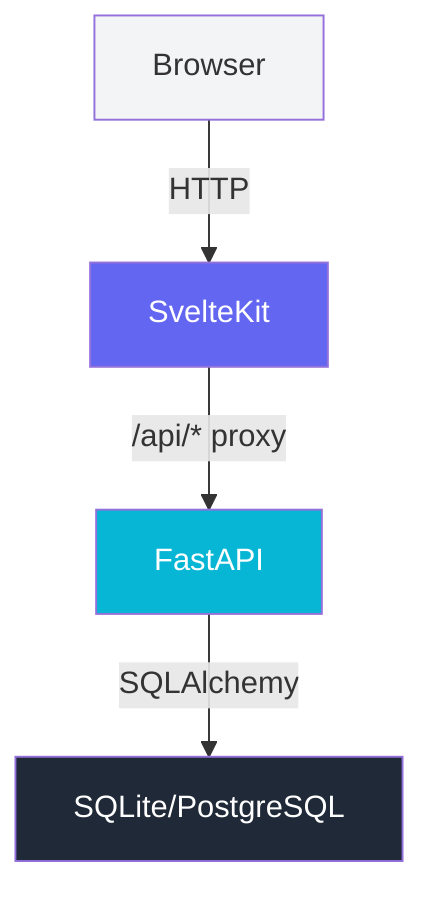

# AI Agents Guide - Hierarchical Context

**Extended guide for AI assistants working on this repository.**

This file extends the root `AGENTS.md` with detailed hierarchical context for AI agents.

---

## 📚 Table of Contents

1. [Repository Metadata](#-repository-metadata)
2. [Project Architecture](#-project-architecture)
3. [Development Environment](#-development-environment)
4. [Codebase Navigation](#-codebase-navigation)
5. [API Development](#-api-development)
6. [Frontend Development](#-frontend-development)
7. [Database & ORM](#-database--orm)
8. [Testing Strategy](#-testing-strategy)
9. [Deployment](#-deployment)
10. [AI-Specific Workflows](#-ai-specific-workflows)

---

## 📦 Repository Metadata

### Identity
- **Owner**: HazelCunuder
- **Repository**: briefs-todo-app-starter
- **Description**: To-Do application with FastAPI, SvelteKit, and Tailwind CSS v4
- **License**: MIT
- **Primary Language**: TypeScript (45%), Python (40%), Markdown (10%), Other (5%)

### Version Control
- **Git Flow**: Rebase-only merge strategy
- **Main Branch**: `main` (production)
- **Development Branch**: `develop` (integration)
- **Feature Branches**: `feature/*`, `fix/*`, `refactor/*`, `docs/*`, `hotfix/*`

### Dependencies

#### Root Level (Bun)
```json
{
  "dependencies": {
    "@commitlint/cli": "^20.4.0",
    "@commitlint/config-conventional": "^20.4.0",
    "gitmoji-cli": "^9.1.0",
    "husky": "^9.1.0",
    "lint-staged": "^15.2.0",
    "markdownlint-cli": "^0.48.0",
    "yamllint": "^0.3.1"
  }
}
```

#### API (Python/uv)
```toml
[project]
name = "todo-api"
version = "0.1.0"
dependencies = [
    "fastapi>=0.115.0",
    "uvicorn[standard]>=0.34.0",
    "sqlalchemy>=2.0.0",
    "pydantic>=2.0.0",
    "python-dotenv>=1.0.0"
]
```

#### Web (Node/npm)
```json
{
  "dependencies": {
    "@sveltejs/adapter-static": "^3.0.0",
    "@sveltejs/kit": "^2.15.0",
    "svelte": "^5.16.0",
    "typescript": "^5.7.0",
    "tailwindcss": "^4.0.0",
    "vite": "^6.0.0"
  }
}
```

---

## 🏗️ Project Architecture

### High-Level Overview



### Service Boundaries

| Service | Port | Responsibility | Technology |
|---------|------|----------------|------------|
| Web (SvelteKit) | 5173 (dev) / 80 (prod) | UI, client-side logic | SvelteKit, Tailwind v4 |
| API (FastAPI) | 8000 | REST API, business logic | FastAPI, SQLAlchemy |
| Database | - | Data persistence | SQLite (dev), PostgreSQL (prod) |
| Nginx | 80 | Reverse proxy (prod) | nginx-unprivileged |

### Communication Flow

```text
Request Flow (Development):
┌─────────┐  HTTP  ┌──────────┐  /api/*  ┌─────────┐  HTTP  ┌──────────┐
│ Browser │───────▶│ SvelteKit │─────────▶│ FastAPI │───────▶│ SQLite  │
│ :5173  │        │ :5173    │  proxy   │ :8000   │        │ todo.db  │
└─────────┘        └──────────┘          └─────────┘        └──────────┘

Request Flow (Production):
┌─────────┐  HTTPS ┌──────────┐  /api/*  ┌─────────┐  HTTP  ┌──────────┐
│ Browser │───────▶│  Nginx   │─────────▶│ FastAPI │───────▶│ PostgreSQL │
│         │        │ :80      │  proxy   │ :8000   │        │ (Docker) │
└─────────┘        └──────────┘          └─────────┘        └──────────┘
```

---

## 💻 Development Environment

### Prerequisites

| Tool | Version | Purpose |
|------|---------|---------|
| Python | >= 3.10 | API development |
| Node.js | >= 20 | Frontend development |
| Bun | >= 1.1 | Root tooling (lint, commit) |
| Docker | >= 24 | Containerization |
| Docker Compose | >= 2 | Orchestration |

### Environment Setup

#### Option 1: Docker Compose (Recommended)
```bash
# Clone and enter repository
git clone https://github.com/HazelCunuder/briefs-todo-app-starter.git
cd briefs-todo-app-starter

# Copy environment template
cp .env.example .env

# Build and start all services
docker compose up --build

# Access:
# - Web: http://localhost:5173
# - API: http://localhost:8000
# - API Docs: http://localhost:8000/docs
```

#### Option 2: Local Development
```bash
# Root level - install tooling
bun install

# API service
cd api
uv sync
uv run uvicorn main:app --reload

# Frontend service (in another terminal)
cd web
npm install
npm run dev

# Linting (from root)
bun run lint
```

### Docker Configuration

#### Networks
```yaml
# docker-compose.yml networks
networks:
  backend:
    driver: bridge
    internal: true  # PostgreSQL isolated
  frontend:
    driver: bridge
```

#### Services
```yaml
services:
  db:
    image: postgres:16-alpine
    networks:
      - backend
    environment:
      POSTGRES_DB: tododb
      POSTGRES_USER: todoapp
      POSTGRES_PASSWORD: ${DB_PASSWORD}
    volumes:
      - pgdata:/var/lib/postgresql/data
    restart: unless-stopped
    healthcheck:
      test: ["CMD-SHELL", "pg_isready -U todoapp -d tododb"]
      interval: 5s
      timeout: 5s
      retries: 5

  api:
    build:
      context: ./api
      dockerfile: Dockerfile
    ports:
      - "8000:8000"
    networks:
      - backend
      - frontend
    environment:
      DATABASE_URL: postgresql://todoapp:${DB_PASSWORD}@db:5432/tododb
    depends_on:
      db:
        condition: service_healthy
    restart: unless-stopped

  web:
    build:
      context: ./web
      dockerfile: Dockerfile
    ports:
      - "5173:80"
    networks:
      - frontend
    depends_on:
      - api
    restart: unless-stopped
```

---

## 🗺️ Codebase Navigation

### Directory Map

```text
briefs-todo-app-starter/
├── AGENTS.md                          # Root AI context (static)
├── README.md                          # Project overview
├── CONTRIBUTING.md                    # Contribution rules
├── CHANGELOG.md                       # Version history
├── LICENSE                            # MIT License
├── docker-compose.yml                 # Service orchestration
├── .env.example                       # Environment template
├── .gitignore                         # Git exclusions
├── .editorconfig                      # Editor settings
├── package.json                       # Bun workspace
├── bun.lock                           # Bun dependencies
├── pyproject.toml                     # Python project config
├── renovate.json                      # Auto-updates config
│
├── api/                               # Backend Service
│   ├── main.py                        # FastAPI app & routes
│   ├── database.py                    # SQLAlchemy setup
│   ├── models.py                      # ORM models
│   ├── schemas.py                     # Pydantic schemas
│   ├── crud.py                        # Database operations
│   ├── Dockerfile                     # Container image
│   ├── .env.example                   # API environment
│   ├── pyproject.toml                 # Python deps (uv)
│   ├── uv.lock                        # uv lockfile
│   └── tests/                         # API tests
│       ├── __init__.py
│       ├── conftest.py               # pytest fixtures
│       ├── test_api.py               # Route tests
│       └── test_crud.py              # CRUD tests
│
├── web/                               # Frontend Service
│   ├── src/
│   │   ├── app.html                   # HTML template
│   │   ├── app.css                    # Tailwind v4 entry
│   │   ├── app.d.ts                   # TypeScript types
│   │   ├── routes/
│   │   │   ├── +layout.svelte         # Root layout
│   │   │   └── +page.svelte           # Main page
│   │   └── lib/
│   │       ├── api.ts                 # Typed fetch client
│   │       ├── types.ts               # TypeScript interfaces
│   │       └── components/
│   │           └── TodoItem.svelte    # Task component
│   ├── package.json                   # npm dependencies
│   ├── vite.config.ts                 # Vite configuration
│   ├── svelte.config.js               # SvelteKit config
│   ├── tsconfig.json                  # TypeScript config
│   ├── Dockerfile                     # Container image
│   ├── nginx.conf                     # Reverse proxy
│   └── tests/                         # Frontend tests
│
└── docs/                              # Documentation
    ├── AGENTS.md                      # THIS FILE - Extended AI guide
    ├── PROJECT_STRUCTURE.md           # Directory layout
    ├── CONVENTIONS.md                 # Code conventions
    ├── TECHNICAL_GUIDE.md             # Implementation guide
    ├── DESIGN_SYSTEM.md               # UI/UX tokens
    ├── COMPONENT_REFERENCE.md         # API & UI reference
    ├── FEATURES.md                    # Epics & stories
    ├── SCREEN_FLOW.md                 # User flows
    └── TASKS.md                       # Task tracking
```

### File Responsibilities

#### API Files

| File | Responsibility | Key Functions/Classes |
|------|----------------|----------------------|
| `main.py` | FastAPI app initialization | `app`, `list_todos`, `get_todo`, `create_todo`, `update_todo`, `delete_todo` |
| `database.py` | Database connection | `engine`, `SessionLocal`, `get_db`, `Base` |
| `models.py` | ORM models | `Todo` (SQLAlchemy model) |
| `schemas.py` | Request/response validation | `TodoBase`, `TodoCreate`, `TodoUpdate`, `TodoResponse` |
| `crud.py` | Database operations | `get_todos`, `get_todo`, `create_todo`, `update_todo`, `delete_todo` |

#### Web Files

| File | Responsibility | Key Exports |
|------|----------------|-------------|
| `+page.svelte` | Main page logic | `todos`, `filter`, `newTitle`, `createTodo`, `toggleTodo`, `deleteTodo` |
| `+layout.svelte` | Root layout | Imports `app.css` |
| `api.ts` | API client | `api` object with typed methods |
| `types.ts` | TypeScript types | `Todo`, `TodoCreate`, `TodoUpdate`, `Filter` |
| `TodoItem.svelte` | Task row component | `editing`, `startEdit`, `saveEdit`, `cancelEdit` |

---

## 🔧 API Development

### FastAPI Application Structure

```python
# main.py
from fastapi import FastAPI, Depends, HTTPException
from sqlalchemy.orm import Session

import crud
import schemas
from database import Base, engine, get_db

# Create tables on startup
Base.metadata.create_all(bind=engine)

app = FastAPI(
    title="To-Do API",
    version="0.1.0",
    description="REST API for managing to-do tasks",
    docs_url="/docs",
    redoc_url="/redoc"
)

# Routes
@app.get("/todos", response_model=list[schemas.TodoResponse])
def list_todos(db: Session = Depends(get_db)):
    return crud.get_todos(db)

@app.post("/todos", response_model=schemas.TodoResponse, status_code=201)
def create_todo(todo: schemas.TodoCreate, db: Session = Depends(get_db)):
    return crud.create_todo(db, todo)
```

### Endpoint Specifications

#### GET /todos
- **Purpose**: List all tasks
- **Response**: `200 OK` with `TodoResponse[]`
- **Example**:
  ```bash
  curl -X GET http://localhost:8000/todos
  ```

#### GET /todos/{todo_id}
- **Purpose**: Get a specific task
- **Parameters**: `todo_id` (path, int, required)
- **Response**: `200 OK` with `TodoResponse` or `404 Not Found`
- **Example**:
  ```bash
  curl -X GET http://localhost:8000/todos/1
  ```

#### POST /todos
- **Purpose**: Create a new task
- **Request Body**: `TodoCreate`
- **Response**: `201 Created` with `TodoResponse`
- **Example**:
  ```bash
  curl -X POST http://localhost:8000/todos \
    -H "Content-Type: application/json" \
    -d '{"title": "Buy groceries", "description": "Milk, eggs, bread"}'
  ```

#### PUT /todos/{todo_id}
- **Purpose**: Update an existing task
- **Parameters**: `todo_id` (path, int, required)
- **Request Body**: `TodoUpdate` (partial)
- **Response**: `200 OK` with `TodoResponse` or `404 Not Found`
- **Example**:
  ```bash
  curl -X PUT http://localhost:8000/todos/1 \
    -H "Content-Type: application/json" \
    -d '{"completed": true}'
  ```

#### DELETE /todos/{todo_id}
- **Purpose**: Delete a task
- **Parameters**: `todo_id` (path, int, required)
- **Response**: `204 No Content` or `404 Not Found`
- **Example**:
  ```bash
  curl -X DELETE http://localhost:8000/todos/1
  ```

### Pydantic Schemas

```python
# schemas.py
from datetime import datetime
from pydantic import BaseModel, Field

class TodoBase(BaseModel):
    title: str = Field(..., min_length=1, max_length=200)
    description: str | None = Field(None, max_length=500)
    completed: bool = False

class TodoCreate(TodoBase):
    pass

class TodoUpdate(BaseModel):
    title: str | None = Field(None, min_length=1, max_length=200)
    description: str | None = Field(None, max_length=500)
    completed: bool | None = None

class TodoResponse(TodoBase):
    id: int
    created_at: datetime
    updated_at: datetime | None = None

    model_config = {"from_attributes": True}
```

### SQLAlchemy Models

```python
# models.py
from sqlalchemy import Column, Integer, String, Boolean, DateTime
from sqlalchemy.sql import func
from database import Base

class Todo(Base):
    __tablename__ = "todos"

    id = Column(Integer, primary_key=True, index=True)
    title = Column(String(200), nullable=False)
    description = Column(String(500), nullable=True)
    completed = Column(Boolean, default=False, nullable=False)
    created_at = Column(DateTime(timezone=True), server_default=func.now(), nullable=False)
    updated_at = Column(DateTime(timezone=True), onupdate=func.now())
```

### CRUD Operations

```python
# crud.py
from sqlalchemy.orm import Session
from models import Todo
from schemas import TodoCreate, TodoUpdate

def get_todos(db: Session) -> list[Todo]:
    return db.query(Todo).order_by(Todo.created_at.desc()).all()

def get_todo(db: Session, todo_id: int) -> Todo | None:
    return db.query(Todo).filter(Todo.id == todo_id).first()

def create_todo(db: Session, todo: TodoCreate) -> Todo:
    db_todo = Todo(**todo.model_dump())
    db.add(db_todo)
    db.commit()
    db.refresh(db_todo)
    return db_todo

def update_todo(db: Session, todo_id: int, todo: TodoUpdate) -> Todo | None:
    db_todo = get_todo(db, todo_id)
    if not db_todo:
        return None
    for key, value in todo.model_dump(exclude_unset=True).items():
        setattr(db_todo, key, value)
    db.commit()
    db.refresh(db_todo)
    return db_todo

def delete_todo(db: Session, todo_id: int) -> bool:
    db_todo = get_todo(db, todo_id)
    if not db_todo:
        return False
    db.delete(db_todo)
    db.commit()
    return True
```

---

## 🎨 Frontend Development

### SvelteKit Structure

```text
web/src/
├── routes/
│   ├── +layout.svelte          # Root layout (shared across all pages)
│   └── +page.svelte            # Main page (task list)
├── lib/
│   ├── api.ts                  # API client
│   ├── types.ts                # TypeScript interfaces
│   └── components/
│       └── TodoItem.svelte     # Task row component
└── app.*                       # App shell files
```

### Typed API Client

```typescript
// web/src/lib/api.ts
import type { Todo, TodoCreate, TodoUpdate } from './types';

const BASE = '/api';

async function request<T>(path: string, init?: RequestInit): Promise<T> {
  const res = await fetch(`${BASE}${path}`, {
    headers: { 'Content-Type': 'application/json' },
    ...init
  });
  if (!res.ok) throw new Error(`${res.status} ${res.statusText}`);
  if (res.status === 204) return undefined as T;
  return res.json() as Promise<T>;
}

export const api = {
  listTodos: () => request<Todo[]>('/todos'),
  getTodo: (id: number) => request<Todo>(`/todos/${id}`),
  createTodo: (payload: TodoCreate) =>
    request<Todo>('/todos', { method: 'POST', body: JSON.stringify(payload) }),
  updateTodo: (id: number, payload: TodoUpdate) =>
    request<Todo>(`/todos/${id}`, { method: 'PUT', body: JSON.stringify(payload) }),
  deleteTodo: (id: number) => request<void>(`/todos/${id}`, { method: 'DELETE' })
};
```

### TypeScript Interfaces

```typescript
// web/src/lib/types.ts
export interface Todo {
  id: number;
  title: string;
  description: string | null;
  completed: boolean;
  created_at: string;
  updated_at: string | null;
}

export interface TodoCreate {
  title: string;
  description?: string | null;
  completed?: boolean;
}

export interface TodoUpdate {
  title?: string;
  description?: string | null;
  completed?: boolean;
}

export type Filter = 'all' | 'active' | 'completed';
```

### Main Page (Svelte 5 Runes)

```svelte
<!-- web/src/routes/+page.svelte -->
<script lang="ts">
  import { api } from '$lib/api';
  import TodoItem from '$lib/components/TodoItem.svelte';
  import type { Filter, Todo, TodoUpdate } from '$lib/types';

  let todos = $state<Todo[]>([]);
  let filter = $state<Filter>('all');
  let newTitle = $state('');

  // Derived value - reactive filtering
  const visibleTodos = $derived.by(() => {
    if (filter === 'active') return todos.filter((t) => !t.completed);
    if (filter === 'completed') return todos.filter((t) => t.completed);
    return todos;
  });

  // Effect - load todos on mount
  $effect(() => {
    api.listTodos().then((list) => (todos = list));
  });

  async function createTodo(e: Event) {
    e.preventDefault();
    const title = newTitle.trim();
    if (!title) return;
    const created = await api.createTodo({ title });
    todos = [created, ...todos];  // Optimistic update
    newTitle = '';
  }

  async function toggleTodo(id: number, completed: boolean) {
    todos = todos.map((t) => (t.id === id ? { ...t, completed } : t));
    await api.updateTodo(id, { completed });
  }

  async function deleteTodo(id: number) {
    todos = todos.filter((t) => t.id !== id);
    await api.deleteTodo(id);
  }
</script>

<!-- Template -->
<main class="mx-auto max-w-2xl px-4 py-10 sm:py-16">
  <!-- Add form -->
  <form onsubmit={createTodo} class="mb-8">
    <input bind:value={newTitle} placeholder="What needs to be done?" required />
    <button type="submit">Add</button>
  </form>

  <!-- Filter tabs -->
  <div class="flex gap-1 mb-6">
    <button class:active={filter === 'all'} on:click={() => (filter = 'all')}>All</button>
    <button class:active={filter === 'active'} on:click={() => (filter = 'active')}>Active</button>
    <button class:active={filter === 'completed'} on:click={() => (filter = 'completed')}>Completed</button>
  </div>

  <!-- Task list -->
  <ul class="space-y-2">
    {#each visibleTodos as todo (todo.id)}
      <TodoItem
        {todo}
        onToggle={toggleTodo}
        onSave={(id, patch) => api.updateTodo(id, patch)}
        onDelete={deleteTodo}
      />
    {/each}
  </ul>
</main>
```

### TodoItem Component

```svelte
<!-- web/src/lib/components/TodoItem.svelte -->
<script lang="ts">
  import type { Todo, TodoUpdate } from '$lib/types';

  interface Props {
    todo: Todo;
    onToggle: (id: number, completed: boolean) => void | Promise<void>;
    onSave: (id: number, patch: TodoUpdate) => void | Promise<void>;
    onDelete: (id: number) => void | Promise<void>;
  }

  let { todo, onToggle, onSave, onDelete }: Props = $props();
  let editing = $state(false);
  let titleDraft = $state('');
  let descriptionDraft = $state('');

  function startEdit() {
    titleDraft = todo.title;
    descriptionDraft = todo.description ?? '';
    editing = true;
  }

  async function saveEdit() {
    const patch: TodoUpdate = {
      title: titleDraft,
      description: descriptionDraft
    };
    await onSave(todo.id, patch);
    editing = false;
  }

  function cancelEdit() {
    editing = false;
  }
</script>

<li class="rounded-lg border border-slate-200 bg-white p-4">
  {#if editing}
    <!-- Edit mode -->
    <input bind:value={titleDraft} class="w-full" />
    <textarea bind:value={descriptionDraft} class="w-full mt-2" />
    <button on:click={saveEdit}>Save</button>
    <button on:click={cancelEdit}>Cancel</button>
  {:else}
    <!-- View mode -->
    <label class="flex items-start gap-3">
      <input
        type="checkbox"
        checked={todo.completed}
        on:change={(e) => onToggle(todo.id, e.currentTarget.checked)}
      />
      <div>
        <h3 class="font-medium" class:text-slate-400={todo.completed} 
            class:line-through={todo.completed}>
          {todo.title}
        </h3>
        {#if todo.description}
          <p class="text-sm text-slate-600">{todo.description}</p>
        {/if}
      </div>
    </label>
    <div class="flex gap-2">
      <button on:click={startEdit}>✏️</button>
      <button on:click={() => onDelete(todo.id)}>🗑️</button>
    </div>
  {/if}
</li>
```

---

## 🗃️ Database & ORM

### Database Configuration

```python
# database.py
import os
from sqlalchemy import create_engine
from sqlalchemy.orm import DeclarativeBase, sessionmaker

DATABASE_URL = os.getenv("DATABASE_URL", "sqlite:///./todo.db")

connect_args = {"check_same_thread": False} if DATABASE_URL.startswith("sqlite") else {}
engine = create_engine(DATABASE_URL, connect_args=connect_args)
SessionLocal = sessionmaker(autocommit=False, autoflush=False, bind=engine)

class Base(DeclarativeBase):
    pass

def get_db():
    db = SessionLocal()
    try:
        yield db
    finally:
        db.close()
```

### Environment Variables

```bash
# .env.example (API)
DATABASE_URL=sqlite:///./todo.db
# DATABASE_URL=postgresql://todoapp:password@db:5432/tododb

# .env.example (Web)
PUBLIC_API_BASE=/api
```

### Database Schema

```sql
-- SQLite/PostgreSQL schema for todos table
CREATE TABLE todos (
    id INTEGER PRIMARY KEY AUTOINCREMENT,
    title VARCHAR(200) NOT NULL,
    description VARCHAR(500),
    completed BOOLEAN NOT NULL DEFAULT FALSE,
    created_at TIMESTAMP NOT NULL DEFAULT CURRENT_TIMESTAMP,
    updated_at TIMESTAMP DEFAULT CURRENT_TIMESTAMP
);

-- Indexes
CREATE INDEX idx_todos_created_at ON todos(created_at DESC);
CREATE INDEX idx_todos_completed ON todos(completed);
```

---

## 🧪 Testing Strategy

### Test Organization

```text
api/tests/
├── __init__.py
├── conftest.py          # pytest fixtures
├── test_api.py          # API route tests
└── test_crud.py         # CRUD operation tests

web/tests/
├── api.test.ts         # API client tests
├── filter.test.ts      # Filter logic tests
└── mocks/
    └── env-public.ts    # Environment mocks
```

### API Tests

```python
# test_api.py
import pytest
from fastapi.testclient import TestClient
from main import app
from database import Base, engine
from models import Todo

@pytest.fixture(scope="module")
def test_db():
    Base.metadata.create_all(bind=engine)
    yield
    Base.metadata.drop_all(bind=engine)

@pytest.fixture
def client(test_db):
    return TestClient(app)

@pytest.fixture
def sample_todo(test_db):
    db_todo = Todo(title="Test task", description="Test description")
    db.add(db_todo)
    db.commit()
    return db_todo

def test_list_todos(client, sample_todo):
    response = client.get("/todos")
    assert response.status_code == 200
    assert len(response.json()) >= 1

def test_create_todo(client):
    response = client.post("/todos", json={"title": "New task"})
    assert response.status_code == 201
    assert response.json()["title"] == "New task"
    assert response.json()["completed"] is False
```

### CRUD Tests

```python
# test_crud.py
import pytest
from sqlalchemy import create_engine
from sqlalchemy.orm import sessionmaker
from database import Base
from models import Todo
from crud import get_todos, create_todo, update_todo, delete_todo
from schemas import TodoCreate, TodoUpdate

@pytest.fixture
def db_session():
    engine = create_engine("sqlite:///:memory:")
    Base.metadata.create_all(bind=engine)
    Session = sessionmaker(bind=engine)
    db = Session()
    yield db
    db.close()

def test_create_and_get_todo(db_session):
    todo_data = TodoCreate(title="Test", description="Description")
    created = create_todo(db_session, todo_data)
    assert created.id is not None
    assert created.title == "Test"
    
    fetched = get_todo(db_session, created.id)
    assert fetched is not None
    assert fetched.title == "Test"

def test_update_todo(db_session):
    todo_data = TodoCreate(title="Test")
    created = create_todo(db_session, todo_data)
    
    update_data = TodoUpdate(title="Updated", completed=True)
    updated = update_todo(db_session, created.id, update_data)
    assert updated is not None
    assert updated.title == "Updated"
    assert updated.completed is True

def test_delete_todo(db_session):
    todo_data = TodoCreate(title="Test")
    created = create_todo(db_session, todo_data)
    
    result = delete_todo(db_session, created.id)
    assert result is True
    
    deleted = get_todo(db_session, created.id)
    assert deleted is None
```

### Frontend Tests

```typescript
// api.test.ts
import { describe, it, expect, vi, beforeEach } from 'vitest';
import { api } from '$lib/api';

// Mock fetch
global.fetch = vi.fn();

describe('api client', () => {
  beforeEach(() => {
    fetch.mockReset();
  });

  it('listTodos returns array', async () => {
    const mockTodos = [{ id: 1, title: 'Test', completed: false }];
    fetch.mockResolvedValue({
      ok: true,
      json: () => Promise.resolve(mockTodos)
    });

    const todos = await api.listTodos();
    expect(todos).toEqual(mockTodos);
    expect(fetch).toHaveBeenCalledWith('/api/todos', expect.anything());
  });

  it('createTodo sends POST request', async () => {
    const newTodo = { title: 'New task' };
    const created = { id: 1, ...newTodo, completed: false };
    fetch.mockResolvedValue({
      ok: true,
      json: () => Promise.resolve(created)
    });

    const result = await api.createTodo(newTodo);
    expect(result).toEqual(created);
    expect(fetch).toHaveBeenCalledWith('/api/todos', {
      method: 'POST',
      headers: { 'Content-Type': 'application/json' },
      body: JSON.stringify(newTodo)
    });
  });
});
```

---

## 🚀 Deployment

### Docker Images

#### API Dockerfile
```dockerfile
# api/Dockerfile
FROM python:3.12-slim

WORKDIR /app

# Install dependencies
COPY pyproject.toml uv.lock ./
RUN uv sync --frozen-lockfile

# Copy application code
COPY . .

# Create non-root user
RUN useradd -m -u 1000 appuser && chown -R appuser:appuser /app
USER appuser

# Run
EXPOSE 8000
CMD ["uv", "run", "uvicorn", "main:app", "--host", "0.0.0.0", "--port", "8000"]
```

#### Web Dockerfile
```dockerfile
# web/Dockerfile
# Stage 1: Build
FROM node:22-alpine AS builder

WORKDIR /app
COPY package.json package-lock.json ./
RUN npm ci --no-audit --no-fund
COPY . .
RUN npm run build

# Stage 2: Runtime
FROM nginxinc/nginx-unprivileged:1.27-alpine

COPY --from=builder /app/build /usr/share/nginx/html
COPY nginx.conf /etc/nginx/conf.d/default.conf

EXPOSE 80
```

### Nginx Configuration
```nginx
# web/nginx.conf
server {
    listen 80;
    server_name localhost;
    root /usr/share/nginx/html;
    index index.html;

    location / {
        try_files $uri $uri/ /index.html;
    }

    location /api/ {
        proxy_pass http://api:8000/;
        proxy_set_header Host $host;
        proxy_set_header X-Real-IP $remote_addr;
        proxy_set_header X-Forwarded-For $proxy_add_x_forwarded_for;
        proxy_set_header X-Forwarded-Proto $scheme;
    }
}
```

### Docker Compose

See [Docker Configuration](#docker-configuration) section above.

---

## 🤖 AI-Specific Workflows

### Session Startup Checklist

At the beginning of every AI session, perform these checks:

1. **Read root AGENTS.md** - For static context
2. **Read docs/AGENTS.md** - For extended context (THIS FILE)
3. **Check git status** - Understand current state
4. **Review recent commits** - Understand recent changes
5. **Check open issues/PRs** - Understand active work
6. **Read relevant docs/** files - For task-specific context

### Common Tasks

#### Adding a New API Endpoint

1. Add route to `api/main.py`
2. Add schema to `api/schemas.py` (if needed)
3. Add CRUD function to `api/crud.py` (if needed)
4. Add tests to `api/tests/`
5. Update `docs/COMPONENT_REFERENCE.md`
6. Update `docs/FEATURES.md` (if new feature)

#### Adding a New Frontend Component

1. Create component in `web/src/lib/components/`
2. Add types to `web/src/lib/types.ts` (if needed)
3. Add API methods to `web/src/lib/api.ts` (if needed)
4. Use component in appropriate page
5. Add tests to `web/tests/`
6. Update `docs/COMPONENT_REFERENCE.md`

#### Fixing a Bug

1. Reproduce the issue
2. Identify the root cause
3. Write a test that reproduces the bug
4. Fix the code
5. Verify the test passes
6. Update documentation if behavior changed

### Debugging Tips

#### API Debugging
```bash
# Check API logs
docker compose logs -f api

# Test endpoint with curl
curl -v http://localhost:8000/todos

# Interactive API docs
http://localhost:8000/docs
```

#### Frontend Debugging
```bash
# Check frontend logs
docker compose logs -f web

# Run with hot reload
cd web && npm run dev

# Type checking
cd web && npm run check
```

#### Database Debugging
```bash
# Connect to PostgreSQL in Docker
docker compose exec db psql -U todoapp -d tododb

# SQLite browser (for development)
sqlite3 api/todo.db
```

### Performance Optimization

#### API Performance
- Use SQLAlchemy `select()` for read-only queries
- Add indexes for frequently queried columns
- Use connection pooling
- Implement caching for expensive queries

#### Frontend Performance
- Use Svelte's built-in reactivity efficiently
- Avoid unnecessary re-renders with `$derived`
- Use lazy loading for large lists
- Optimize bundle size with Vite

---

## 📊 Project Metrics

### Code Metrics
- **Total Lines of Code**: ~2,500 (API + Web)
- **API Lines**: ~500
- **Web Lines**: ~1,500
- **Test Coverage**: ~80% (target)
- **Documentation Lines**: ~5,000

### Dependencies
- **API Dependencies**: 5 (FastAPI, Uvicorn, SQLAlchemy, Pydantic, python-dotenv)
- **Web Dependencies**: 6 (SvelteKit, Svelte, TypeScript, Tailwind, Vite, @sveltejs/adapter-static)
- **Root Dependencies**: 7 (Bun tooling)

### Container Sizes
- **API Image**: ~150MB
- **Web Image**: ~50MB
- **PostgreSQL Image**: ~200MB

---

## 🔮 Future Roadmap

### Short-term (Next 3 months)
- [ ] Add user authentication (JWT)
- [ ] Implement task categories/tags
- [ ] Add due dates and reminders
- [ ] Improve error handling and validation
- [ ] Add more comprehensive tests

### Medium-term (3-6 months)
- [ ] Add real-time updates with WebSockets
- [ ] Implement task sharing/collaboration
- [ ] Add search functionality
- [ ] Implement pagination for task lists
- [ ] Add file attachments to tasks

### Long-term (6-12 months)
- [ ] Mobile app (React Native or Capacitor)
- [ ] Desktop app (Tauri)
- [ ] Offline-first support
- [ ] Multi-language support
- [ ] Advanced analytics and insights

---

## 🎓 Learning Resources

### FastAPI
- [FastAPI Official Docs](https://fastapi.tiangolo.com/)
- [FastAPI Tutorial](https://fastapi.tiangolo.com/tutorial/)
- [FastAPI Advanced](https://fastapi.tiangolo.com/advanced/)

### SvelteKit
- [SvelteKit Official Docs](https://kit.svelte.dev/)
- [Svelte Tutorial](https://svelte.dev/tutorial/basics)
- [Svelte 5 Runes](https://svelte-5-preview.vercel.app/docs/runes)

### Tailwind CSS
- [Tailwind CSS Docs](https://tailwindcss.com/docs)
- [Tailwind v4 Migration](https://tailwindcss.com/docs/upgrade-guide)
- [Tailwind UI](https://tailwindui.com/) (paid components)

### SQLAlchemy
- [SQLAlchemy 2.0 Docs](https://www.sqlalchemy.org/)
- [SQLAlchemy ORM Tutorial](https://docs.sqlalchemy.org/en/14/orm/tutorial.html)
- [SQLAlchemy Core Tutorial](https://docs.sqlalchemy.org/en/14/core/tutorial.html)

### Docker
- [Docker Docs](https://docs.docker.com/)
- [Docker Compose](https://docs.docker.com/compose/)
- [Docker Best Practices](https://docs.docker.com/develop/dev-best-practices/)

---

## 📝 Changelog

| Date | Change | Author |
|------|--------|--------|
| 2026-04-29 | Initial hierarchical AGENTS.md | AI Agent |
| 2026-04-29 | Updated root AGENTS.md with static context | AI Agent |

---

## 🆘 Troubleshooting

### Common Issues

#### Docker Compose Fails to Start
- **Symptom**: `port already in use`
- **Solution**: Run `docker compose down` and try again
- **Prevention**: Always stop services before starting

#### API Connection Refused
- **Symptom**: `Connection refused` when calling API
- **Solution**: Check if API container is running: `docker compose ps`
- **Prevention**: Ensure all services are started with `docker compose up -d`

#### Database Connection Errors
- **Symptom**: SQLAlchemy connection errors
- **Solution**: Check `DATABASE_URL` environment variable
- **Prevention**: Use `.env.example` as template for `.env`

#### Frontend Build Fails
- **Symptom**: `npm run build` fails
- **Solution**: Delete `node_modules` and `package-lock.json`, then `npm install`
- **Prevention**: Always use `npm ci` in CI/CD pipelines

#### TypeScript Errors
- **Symptom**: Type errors in Svelte components
- **Solution**: Run `npm run check` to see detailed errors
- **Prevention**: Use explicit types for all props and variables

### Getting Help

1. **Check the documentation** in `docs/`
2. **Review the code** for existing patterns
3. **Search GitHub issues** for similar problems
4. **Ask in discussions** (if available)
5. **Open a new issue** with reproduction steps

---

*This file is part of the hierarchical context for AI agents. It extends the root AGENTS.md with detailed technical information.*
*Last updated: 2026-04-29*
